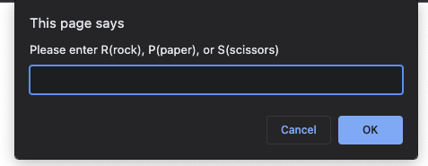
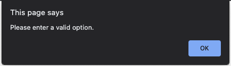
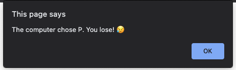
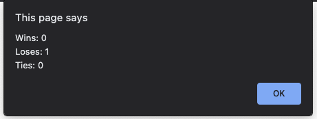
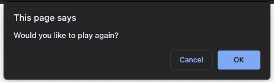
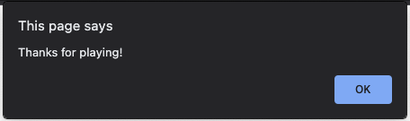

# ROCK, PAPER, SCISSORS!

This is a simple game of "Rock, Paper, Scissors" played using prompt(), confirm(), and alert() methods, as well as else if statements.
 

The user is prompted to input "R", "P", or "S".
 

 

- Lowercase entries are automatically changed to uppercase using toUppercase()
- Invalid entries result in an alert to enter a valid option
   

  

     

The computer makes a choice (in the background) using math.floor and math.random

The user is then shown the computer's choice and told if they have won or lost

 

 

User is then shown a scoreboard of Wins, Losses, and Ties.

 

 

User is asked if they would like to play again with a confirm()

 

 

If not:

 

